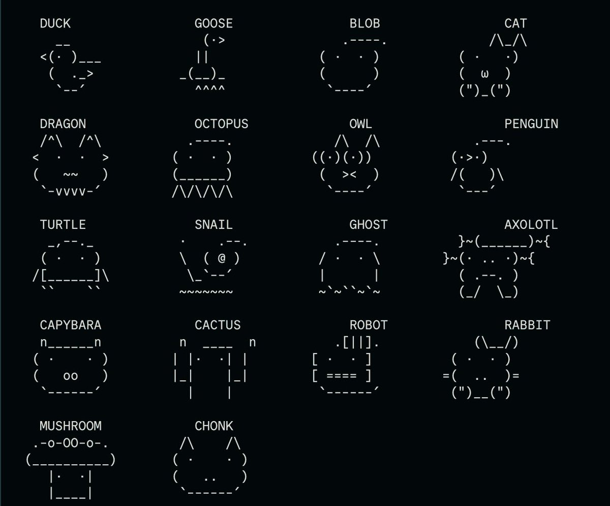

# ChangeClaudePet

Customize your Claude Code companion by finding the perfect UUID seed.

Claude Code generates a unique buddy for each user based on their account UUID.
ChangeClaudePet lets you search millions of seeds in parallel to find one that
produces the exact companion you want — species, rarity, stats, cosmetics, and all.

<video src="https://github.com/DrishtantKaushal/ChangeClaudePet/raw/main/demo/BuddyProgram.mp4" controls width="100%"></video>

## Quick Start

```bash
bun install
bun start
```

The interactive CLI walks you through picking your ideal traits, then hunts
for matching UUIDs using all available CPU cores.

## What You Can Filter

| Category   | Options                                                                                    |
| ---------- | ------------------------------------------------------------------------------------------ |
| Species    | duck, goose, blob, cat, dragon, octopus, owl, penguin, turtle, snail, ghost, axolotl, etc. |
| Rarity     | common · uncommon · rare · epic · legendary                                                |
| Cosmetics  | eye style, hat, shiny status                                                               |
| Stats      | DEBUGGING, PATIENCE, CHAOS, WISDOM, SNARK — pick peak/dump or set a minimum total          |



## Applying Your Choice

Once you find a UUID you like:

1. Open `~/.claude/.config.json`
2. Set `oauthAccount.accountUuid` to the UUID from the results
3. Restart Claude Code

> **Note:** Re-authenticating will overwrite the UUID back to your real one.

## Library Usage

```ts
import { rollFrom, search } from "./src/index.ts";

// Preview the buddy for any UUID
const buddy = rollFrom("some-uuid-here");

// Search with filters
const results = search({
  species: "axolotl",
  rarity: "legendary",
  limit: 3,
  max: 10_000_000,
});
```

## How It Works

The companion system seeds a Mulberry32 PRNG with a hash of `userId + salt`.
Each seed deterministically produces rarity, species, cosmetics, and stat
distribution. ChangeClaudePet replicates that generation algorithm to preview
companions for arbitrary UUIDs without running Claude Code itself.

For large searches (500k+ seeds), work is distributed across Web Worker threads
for parallel execution.

## Attribution

The companion generation algorithm is based on work by
[Rayhan Noufal Arayilakath](https://github.com/rayhanadev/claude-petpet),
originally published under the MIT license.

## Legal Notice

The companion generation algorithm was derived from source maps that were
publicly served alongside Claude Code's client-side JavaScript via NPM.
No access controls, obfuscation, or technological protection measures were
circumvented — the source maps were openly available to end users.

Reimplementing a functional algorithm from publicly available materials is
well-established as lawful:

- **No DMCA §1201 issue** — no protection measure was bypassed; the source
  maps were publicly accessible without authentication
- **Fair use** — functional algorithms are not copyrightable expression
  (see *Oracle v. Google*, 593 U.S. 1 (2021))
- **DMCA §1201(f)** — reverse engineering for interoperability is
  independently permitted
- **EU Software Directive (2009/24/EC) Art. 6** — permits analysis for
  interoperability

This project is not affiliated with or endorsed by Anthropic, PBC.
"Claude" and "Claude Code" are trademarks of Anthropic.

## License

[MIT](LICENSE)
